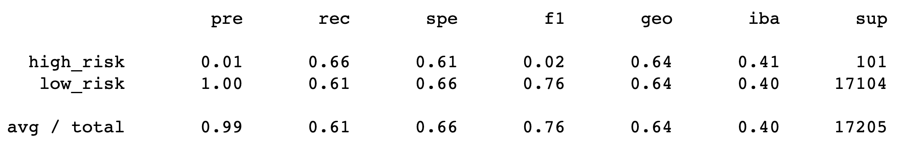
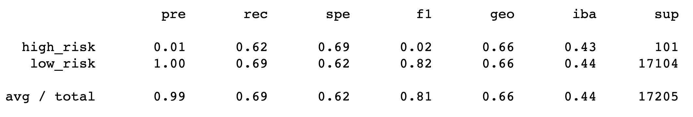
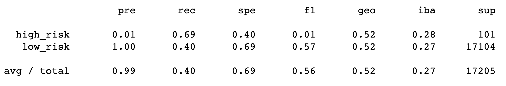
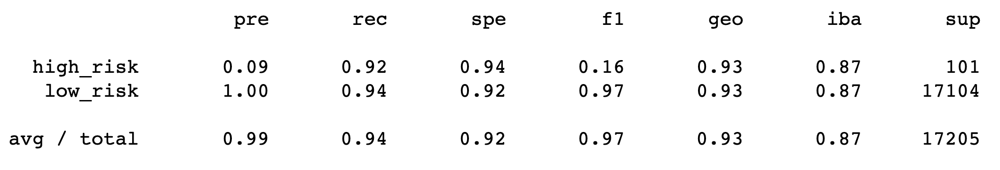

# Credit Risk Analysis
Assess various models on their ability to predict credit risk

## Overview

This study uses data obtained from LendingClub, a peer to peer lending services company, 

## Results

### Resampling Techniques

- Naive Random Oversampling

Fig. Imbalanced classification report for naive random oversampling.

- SMOTE Oversampling

Fig. Imbalanced classification report for SMOTE oversampling.

- Cluster Centroids Undersampling

Fig. Imbalanced classification report for cluster centroids undersampling.

- SMOTEENN Combination Over and Under Sampling

Fig. Imbalanced classification report for naive random oversampling.

### Ensemble Learners

- Balanced Random Forest Classifier

Fig. Imbalanced classification report for naive random oversampling.

- Easy Ensemble AdaBoost Classifier

Fig. Imbalanced classification report for naive random oversampling.

## Summary

| Algorithmic Model | Balanced Accuracy Score |
| --- | :---: |
| Naive Random Oversampling | 0.6384 |
| SMOTE Oversampling | 0.6589 |
| Cluster Centroids Undersampling | 0.5447 |
| SMOTEENN Combination Over/Under Sampling | 0.6483 |
| Balanced Random Forest Classifier | 0.7885 |
| Easy Ensemble AdaBoost Classifier | 0.9317 |
Table. Balanced accuracy scores for the six models used.